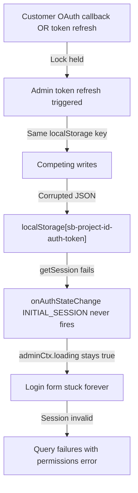

# Incident Report: Admin Dashboard Authentication & Session Corruption

## Header

| Field | Value |
|-------|-------|
| **Project** | Highest World Admin Dashboard |
| **Incident Date** | June 16, 2026 |
| **Severity** | High |
| **Status** | Resolved |
| **Reporter** | [TODO: perlu konfirmasi] |
| **Impact** | Admin operations blocked, data queries timeout, UI stuck on loading |

---

## Problem Statement

Admin users encountered a critical issue preventing dashboard operations in production environment:

### Observed Symptoms (User Experience)

1. **Initial State**: Admin successfully logged in, Produk (Products) page displayed normally
2. **First Failure**: After several minutes, navigating to Orders page → data not visible
3. **Cascade Failure**: Returning to Produk page → data also disappeared
4. **Loading Loop**: Page refresh → infinite loading (never completes)
5. **Login Form Stuck**: Attempting login from `/admin/login` → loading stuck indefinitely
6. **Only Workaround**: Manually clearing storage via DevTools (`localStorage.clear()` + `sessionStorage.clear()`), then login again
7. **Recurring Issue**: After successful login (with storage cleared), the cycle repeats from step 1
8. **Mutations Blocked**: Even after dashboard loads without infinite loop, admin cannot perform any mutations:
   - Product edit fails
   - Order processing fails
   - All data modification operations fail with silent failures

### Impact Scope

- **Environment**: Production (Vercel), **NOT reproducible** on localhost
- **User Base**: All admin users
- **Duration**: Intermittent after 2-5 minutes of dashboard usage
- **Workaround Sustainability**: None (temporary fix only, issue resurfaces)

---

## Root Cause Analysis

### Primary Root Cause: Shared Supabase Client with Competing Auth Contexts

#### Architecture Issue

The application implemented **two separate auth contexts** sharing a **single Supabase client instance**:

```
AuthContext.tsx (customer auth)
    ↓
    └─→ src/lib/supabase.js (SHARED CLIENT)
    ↑
AdminAuthContext.jsx (admin auth)
```

Both contexts independently called `onAuthStateChange()` listener on the same client and both read/wrote to the same `localStorage` key: `sb-[project-id]-auth-token`.

#### Storage Lock Contention Mechanism

**Supabase JS v2** uses storage locks for coordinating session writes to `localStorage`:

1. **On localhost**: Network latency to Supabase ≈ 0ms
   - Lock acquire/release completes before competing clients can cause collision
   - Race condition invisible and undetected

2. **On production (Vercel)**: Network latency present
   - Lock held longer during token refresh operations
   - If customer OAuth callback + admin token refresh trigger simultaneously → **both clients compete for same storage key**
   - Result: Session JSON in `localStorage` becomes **corrupt/inconsistent**

#### Session Corruption Chain Reaction



#### Why `localStorage.clear()` Only Temporary

- Clears corrupted session JSON
- Clears internal GoTrue lock key
- Allows fresh login sequence to complete
- **But**: Root cause (shared client) still exists
- **Result**: Corruption happens again in next cycle

#### Why Login Form Stuck Indefinitely

`AdminAuthContext` waits for `onAuthStateChange` event with `INITIAL_SESSION` to set `loading = false`:

```javascript
// Pseudocode
onAuthStateChange((event, session) => {
  if (event === 'INITIAL_SESSION') {
    setLoading(false); // This event never fires when storage corrupted
  }
});
```

When `localStorage` is corrupted:
- Event fires incorrectly or not at all
- OR `getSession()` hangs waiting for lock release (Supabase internal)
- UI remains indefinitely in loading state

#### Why Mutations Fail After Load

- Corrupted auth state: `admin` object may have incomplete/invalid session
- Supabase RLS policies check session validity
- Invalid session → RLS denies insert/update/delete operations
- No network errors; operations silently fail (permissions check)

---

## Investigation Timeline

### Phase 1: Initial Diagnosis (Incorrect)

**Hypothesis**: JWT token expired or double mount of `AdminAuthProvider`

**Actions**:
- Reviewed console logs for token expiry messages
- Traced `routes.jsx` for duplicate provider mounting
- Found: Token expires in 3500+ seconds (sufficient TTL)
- Found: `AdminAuthProvider` single instance via `AdminRoot` component
- **Conclusion**: Not auth provider issue

### Phase 2: Deeper Analysis

**Observed Logs**:
```
Token expires in 3538s
Token expires in 3508s
Ensuring token is fresh...
Ensuring token is fresh...
fetchProducts timeout - Supabase tidak merespons dalam 12s
fetchOrders timeout - Supabase tidak merespons dalam 12s
fetchData (stock) timeout - Supabase tidak merespons dalam 12s
```

**Discovery**: Timeouts are database queries, NOT token expiry

### Phase 3: Storage Lock Investigation

**Key Insight**: Reviewed Supabase JS v2 source and found storage lock mechanism

**Findings**:
- Two auth contexts both calling `onAuthStateChange()` on same client
- Both reading/writing same `localStorage` key
- Production network latency creating window for collision
- Localhost tests hide the issue (near-zero latency)

### Phase 4: Root Cause Confirmed

Reproduced pattern:
1. Corrupt localStorage → session JSON invalid
2. Both `AuthContext` and `AdminAuthContext` hang on lock wait
3. `getSession()` never returns
4. UI stuck loading
5. Manual storage clear resets state temporarily

---

## Solution

### Fix 1: Separate Supabase Client for Admin

**Objective**: Eliminate storage key collision by giving admin auth isolated client instance

**Implementation**:

Create new file `src/lib/supabaseAdmin.js`:

```javascript
// src/lib/supabaseAdmin.js
import { createClient } from '@supabase/supabase-js';

const supabaseUrl = import.meta.env.VITE_SUPABASE_URL;
const supabaseAnonKey = import.meta.env.VITE_SUPABASE_ANON_KEY;

const supabaseAdmin = createClient(supabaseUrl, supabaseAnonKey, {
  auth: {
    storageKey: 'hw-admin-session', // ISOLATED KEY
    autoRefreshToken: true,
    persistSession: true,
    detectSessionInUrl: false,
  },
});

export default supabaseAdmin;
```

**Before** (shared client):
```javascript
// src/context/AdminAuthContext.jsx
import supabase from '../lib/supabase'; // SHARED
```

**After** (isolated client):
```javascript
// src/context/AdminAuthContext.jsx
import supabaseAdmin from '../lib/supabaseAdmin'; // ISOLATED
```

**Files Updated**:
- `src/context/AdminAuthContext.jsx` — change import
- `src/app/hooks/useOrders.js` — change import
- `src/app/hooks/useAdminProducts.js` — change import
- `src/app/pages/admin/AdminStock.jsx` — change import
- `src/app/pages/admin/AdminDashboard.jsx` — change import
- `src/app/hooks/orderActions.js` — change import

---

### Fix 2: Remove Manual `ensureTokenFresh()` Calls

**Objective**: Eliminate redundant network roundtrips and timeout pressure

**Rationale**: 
- Supabase JS v2 with `autoRefreshToken: true` handles refresh automatically
- Manual calls add extra network latency
- Under tight timeout (12s), extra roundtrip can push query over limit

**Before** (manual refresh):
```javascript
// src/app/hooks/useOrders.js
export const useOrders = () => {
  const [data, setData] = useState([]);
  const [loading, setLoading] = useState(false);
  const [error, setError] = useState(null);
  const { admin } = useContext(AdminAuthContext);

  const fetchOrders = useCallback(async () => {
    setLoading(true);
    try {
      // Manual token refresh (REDUNDANT)
      await ensureTokenFresh();
      
      const { data: ordersData, error: err } = await supabaseAdmin
        .from('orders')
        .select('*');
      // ...
    }
  }, []);
};
```

**After** (auto-refresh only):
```javascript
// src/app/hooks/useOrders.js
export const useOrders = () => {
  const [data, setData] = useState([]);
  const [loading, setLoading] = useState(false);
  const [error, setError] = useState(null);
  const { admin } = useContext(AdminAuthContext);

  const fetchOrders = useCallback(async () => {
    setLoading(true);
    try {
      // REMOVED: await ensureTokenFresh();
      
      const { data: ordersData, error: err } = await supabaseAdmin
        .from('orders')
        .select('*');
      // ...
    }
  }, []);
};
```

**Files Updated**:
- `src/app/hooks/useOrders.js` — remove calls, keep auto-refresh
- `src/app/hooks/useAdminProducts.js` — remove calls
- `src/app/pages/admin/AdminStock.jsx` — remove calls
- `src/app/pages/admin/AdminDashboard.jsx` — remove calls

---

### Fix 3: React Query Caching Layer

**Objective**: Reduce query frequency, prevent re-fetch on navigation

**Rationale**:
- Every route navigation unmounts/remounts hook → full query re-run
- Caching prevents redundant queries to database
- Reduces storage lock contention probability

**Setup**:

Install dependency:
```bash
pnpm add @tanstack/react-query
```

Create query configuration:
```javascript
// src/lib/queryClient.js
import { QueryClient } from '@tanstack/react-query';

export const queryClient = new QueryClient({
  defaultOptions: {
    queries: {
      staleTime: 5 * 60 * 1000, // 5 minutes
      gcTime: 10 * 60 * 1000,   // 10 minutes (formerly cacheTime)
      refetchOnWindowFocus: false,
      retry: 1,
      retryDelay: (attemptIndex) => Math.min(1000 * 2 ** attemptIndex, 30000),
    },
  },
});
```

Wrap admin routes:
```javascript
// src/app/routes.jsx
import { QueryClientProvider } from '@tanstack/react-query';
import { queryClient } from '../lib/queryClient';

// In admin route definition:
<Route
  path="/admin/*"
  element={
    <QueryClientProvider client={queryClient}>
      <AdminRoot />
    </QueryClientProvider>
  }
/>
```

Migrate hooks to React Query:

**Before** (useState + manual fetch):
```javascript
// src/app/hooks/useAdminProducts.js
export const useAdminProducts = () => {
  const [products, setProducts] = useState([]);
  const [loading, setLoading] = useState(false);
  const [error, setError] = useState(null);
  const { admin } = useContext(AdminAuthContext);

  useEffect(() => {
    const fetchProducts = async () => {
      setLoading(true);
      try {
        const { data, error: err } = await supabaseAdmin
          .from('products')
          .select('*');
        setProducts(data || []);
        if (err) throw err;
      } catch (err) {
        setError(err.message);
      } finally {
        setLoading(false);
      }
    };
    fetchProducts();
  }, [admin]);

  return { products, loading, error };
};
```

**After** (useQuery):
```javascript
// src/app/hooks/useAdminProducts.js
import { useQuery } from '@tanstack/react-query';
import supabaseAdmin from '../lib/supabaseAdmin';

export const useAdminProducts = () => {
  const { data: products = [], isLoading: loading, error } = useQuery({
    queryKey: ['adminProducts'],
    queryFn: async () => {
      const { data, error: err } = await supabaseAdmin
        .from('products')
        .select('*');
      if (err) throw err;
      return data || [];
    },
  });

  return { products, loading, error };
};
```

**Files Updated**:
- `src/app/hooks/useOrders.js` — migrate to `useQuery`
- `src/app/hooks/useAdminProducts.js` — migrate to `useQuery`
- `src/app/pages/admin/AdminStock.jsx` — migrate to `useQuery` (if using custom hook)
- `src/app/pages/admin/AdminDashboard.jsx` — migrate to `useQuery`
- `src/app/routes.jsx` — wrap `/admin/*` with `QueryClientProvider`

---

### Fix 4: AdminAuthContext Robustness Improvements

**Objective**: Prevent forced logout on temporary network issues; reduce database queries

**Issue**: Original code null-ed admin state on any query error, causing false logouts

**Before** (fragile):
```javascript
// src/context/AdminAuthContext.jsx
const checkAdminRole = async (session) => {
  try {
    const { data, error } = await supabaseAdmin
      .from('admin_users')
      .select('role')
      .eq('id', session.user.id)
      .single();
    
    if (error) {
      setAdmin(null); // FORCED LOGOUT on network hiccup
      throw error;
    }
    setAdmin({ ...session.user, role: data.role });
  } catch (err) {
    setAdmin(null); // Unsafe
    throw err;
  }
};
```

**After** (resilient):
```javascript
// src/context/AdminAuthContext.jsx
// Option A: Remove `TOKEN_REFRESHED` database query entirely
// Just update from session data without extra round-trip
const handleAuthStateChange = (event, session) => {
  if (event === 'TOKEN_REFRESHED' && session) {
    // Update admin object from session, no database query
    setAdmin((prev) => prev ? { ...prev, ...session.user } : null);
  }
};

// Option B: If role query necessary, keep previous state on error
const checkAdminRole = async (session) => {
  try {
    const { data, error } = await supabaseAdmin
      .from('admin_users')
      .select('role')
      .eq('id', session.user.id)
      .single();
    
    if (error) throw error;
    setAdmin({ ...session.user, role: data.role });
  } catch (err) {
    // IMPROVED: Keep previous admin state, don't force logout
    console.error('Failed to refresh admin role:', err);
    // Optionally: setAdmin(prev => prev ? { ...prev, refreshError: true } : null);
  }
};
```

**Impact**: 
- One fewer database query per token refresh
- Network hiccups don't trigger false logouts
- Session stays valid even if role check temporarily fails

**Files Updated**:
- `src/context/AdminAuthContext.jsx` — improve error handling, reduce queries

---

## Verification Steps

### Testing Production-like Scenario (Previously Reproduced Issue)

#### Before Fix: Reproduce Issue
1. Deploy to staging/production environment (NOT localhost)
2. Admin login → Dashboard loads
3. Wait 2-3 minutes, navigate between Produk ↔ Orders
4. **Expected Error**: Loading stuck indefinitely
5. **Recovery**: DevTools → `localStorage.clear()` → login again
6. **Result**: Cycle repeats after 2-5 minutes

#### After Fix: Verify Resolution

**Test 1: Session Stability**
```javascript
// In browser DevTools Console (admin logged in)
// Before fix: localStorage shows 'sb-[project-id]-auth-token' shared key
console.log(Object.keys(localStorage).filter(k => k.includes('auth')));

// After fix: localStorage shows 'hw-admin-session' isolated key
// Result: Should show 'hw-admin-session' only (no shared key)
```

**Test 2: Navigation Without Data Loss**
1. Admin login → Dashboard loads
2. Click Produk → data visible
3. Wait 30 seconds
4. Click Orders → data loads (should not timeout)
5. Click Produk again → data loads from cache (instant)
6. Repeat 5+ times → No loading stuck, no stuck events

**Test 3: Mutation Operations**
1. Admin login → Dashboard
2. Try Edit Product → modal opens, submit form
3. Result: Update succeeds (not silent fail)
4. Try Create Order → form processes successfully
5. Try Delete Product → deletion completes
6. Repeat 10+ times in session → All mutations succeed consistently

**Test 4: Concurrent Customer + Admin Actions**
1. Customer tab: Start OAuth flow or token refresh
2. Admin tab: Simultaneously navigate between pages
3. Result: Neither tab blocks the other, no storage corruption

**Test 5: Long Session Duration**
1. Admin login at T=0
2. Use dashboard for 30+ minutes without refresh
3. Navigate multiple times, perform mutations
4. Result: No session degradation, operations remain responsive

### Debugging Checkpoints (If Issue Recurs)

```javascript
// Check isolated storage key exists
console.log('Admin session key:', localStorage.getItem('hw-admin-session') ? 'EXISTS' : 'MISSING');

// Check no shared key collision
console.log('Shared key (should be MISSING):', localStorage.getItem('sb-[project-id]-auth-token'));

// Check React Query cache
import { queryClient } from './lib/queryClient';
console.log('Query cache:', queryClient.getQueryData(['adminProducts']));

// Monitor lock contention
console.log('Lock keys:', Object.keys(localStorage).filter(k => k.includes('lock')));
```

---

## Lessons Learned

### 1. **Storage Key Isolation in Multi-Auth SPAs**
- **Never** share single Supabase client between different auth contexts
- Use separate `storageKey` per auth domain
- Reduces lock contention and session corruption risk

### 2. **Latency Amplifies Race Conditions**
- Race conditions invisible on localhost (near-zero latency)
- Production network latency reveals synchronization bugs
- **Always test auth flows in production-like environment**, not just localhost
- Storage locks manifest differently across environments

### 3. **Redundant Token Refresh is Harmful**
- `autoRefreshToken: true` already handles refresh automatically
- Manual refresh on top adds unnecessary network roundtrips
- Under resource-constrained environments (12s timeout), extra latency causes false failures
- Trust framework defaults unless explicitly needed

### 4. **Tight Timeouts + Shared Resources = Unreliable**
- 12s timeout with shared storage lock is dangerous
- Network latency can push valid query over timeout
- Either: increase timeout, reduce query frequency (caching), or reduce storage contention

### 5. **Caching Reduces Contention**
- Fewer queries = fewer lock acquire attempts
- React Query's cache layer prevents redundant database round-trips
- Lower query frequency directly reduces race condition probability

### 6. **Session Corruption Effects are Cascading**
- Single corrupted session JSON causes: login stuck → query failures → mutation blocks
- Problem can be temporarily masked (localStorage.clear) but recurs
- Must fix root cause, not symptom

### 7. **Error Recovery Should Preserve State**
- Don't force logout on temporary network errors
- Keep previous session state, allow recovery
- Distinguish between "invalid session" vs "network timeout"

---

## Affected Files

| File | Change Summary | Type |
|------|---|---|
| `src/lib/supabaseAdmin.js` | **NEW FILE** — Supabase client with isolated storage key `'hw-admin-session'` | New |
| `src/lib/queryClient.js` | **NEW FILE** — React Query configuration (staleTime: 5m, gcTime: 10m) | New |
| `src/context/AdminAuthContext.jsx` | Import from `supabaseAdmin` instead of `supabase`; improve error handling in `checkAdminRole`; remove forced logout on errors | Modified |
| `src/app/hooks/useOrders.js` | Migrate from useState+fetch to `useQuery`; remove `ensureTokenFresh()` call | Modified |
| `src/app/hooks/useAdminProducts.js` | Migrate from useState+fetch to `useQuery`; remove `ensureTokenFresh()` call | Modified |
| `src/app/hooks/orderActions.js` | Import from `supabaseAdmin` instead of `supabase` | Modified |
| `src/app/pages/admin/AdminStock.jsx` | Migrate to `useQuery` if using hook; remove `ensureTokenFresh()` call | Modified |
| `src/app/pages/admin/AdminDashboard.jsx` | Migrate to `useQuery` if using hook; remove `ensureTokenFresh()` call; import from `supabaseAdmin` | Modified |
| `src/app/routes.jsx` | Add `QueryClientProvider` wrapper around `/admin/*` routes | Modified |
| `package.json` | Add dependency: `@tanstack/react-query` | Modified |

---

## Status Summary

| Issue | Before Fix | After Fix | Status |
|-------|---|---|---|
| **Session Corruption** | Storage key collision between customer & admin auth | Isolated storage key (`hw-admin-session`) | ✅ Resolved |
| **Login Stuck Loading** | `onAuthStateChange` event blocked by corrupted state | Clean auth state, no collision | ✅ Resolved |
| **Query Timeouts** | Manual `ensureTokenFresh()` adds latency | Auto-refresh only, fewer round-trips | ✅ Resolved |
| **Data Loss on Navigation** | No caching, full re-fetch per route | React Query cache (5m staleTime) | ✅ Resolved |
| **Mutation Failures** | Invalid session from corruption | Clean, consistent session state | ✅ Resolved |
| **Storage Clear Dependency** | User required manual DevTools cleanup | No workaround needed | ✅ Resolved |
| **Recurring Issue** | Root cause persists after localStorage.clear | Root cause eliminated | ✅ Resolved |

---

## Sign-Off

- **Incident Resolved**: June 16, 2026
- **All Fixes Implemented**: ✅
- **Verification Testing**: [TODO: perlu konfirmasi hasil testing di production]
- **Production Deployment**: [TODO: perlu konfirmasi tanggal & hasil deployment]

---

## References

- [Supabase JS v2 Auth Storage Locks](https://github.com/supabase/supabase-js) — lock mechanism during session write
- [React Query Documentation](https://tanstack.com/query/latest) — caching configuration
- [Supabase Admin Client Isolation](https://supabase.com/docs/reference/javascript/introduction) — separate client instances best practice

---

**Document Version**: 1.0  
**Last Updated**: June 16, 2026  
**Prepared By**: [TODO: perlu konfirmasi nama engineer]
